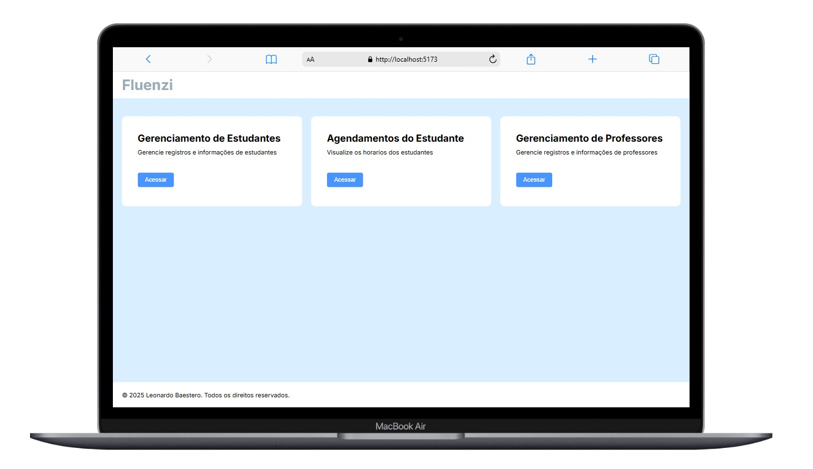

## Fluenzi

**Fluenzi** é uma aplicação web desenvolvida com **React** e **Vite**, voltada para a **gestão de escolas de idiomas**.

Ela permite o controle e acompanhamento de turmas, alunos, professores, horários, matrículas e pagamentos, tudo em uma interface moderna, responsiva e fácil de usar.
(em desevolvimento)

### 🖼️ Preview

### Tecnologias utilizadas

- **React**
- **Vite**

---
